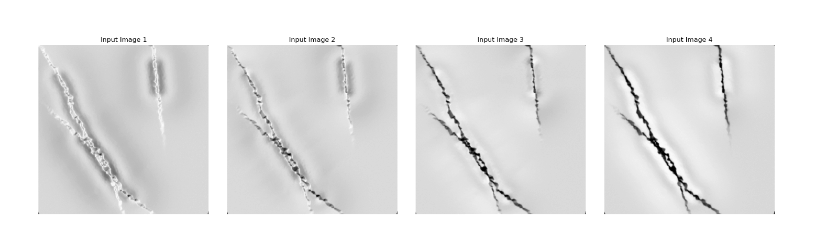
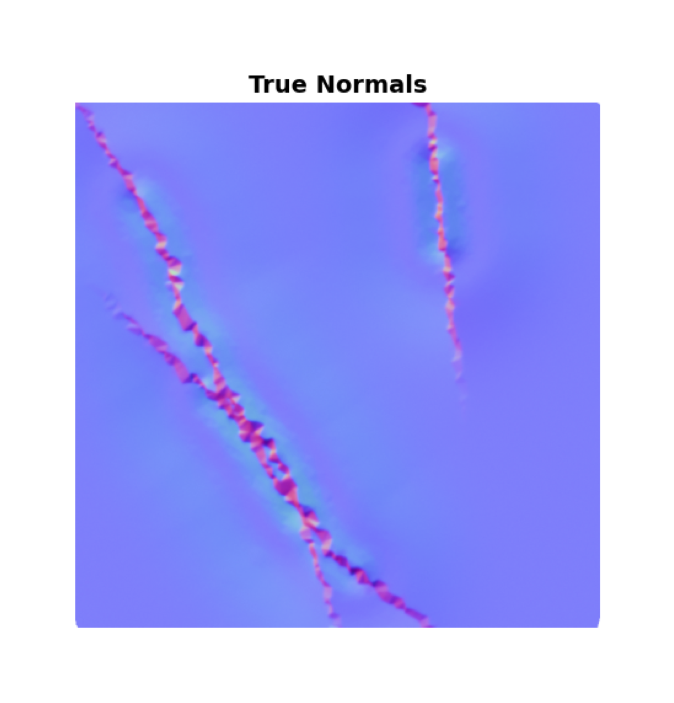
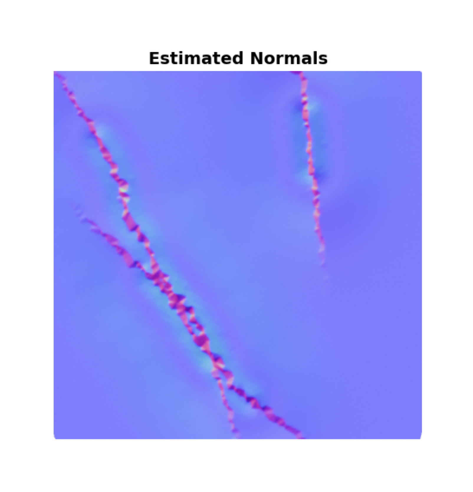

# Photometric Stereo Imaging for Detecting Surface Defects
**Author:** David Wu \
**Last Updated:** 11/1/2025 \
Applies photometric stereo to detect surface defects by computing surface normals.

**Future Directions:** Train classifier to perform classification on different types of surface flaws, e.g., bumps vs. indentations vs. creases.

## Table of Contents
- [Installation](#installation)
- [Usage](#usage)
- [Simulated Results](#simulated-results)

## Installation
```bash
git clone https://github.com/David-Ch-W/photometric-stereo.git

# Optionally create environment with required packages
conda env create -f photometric-stereo.yaml
```
**Dependencies** \
Only the `numpy` package is required for calculation. Additional packages are needed for generating examples and plotting. We provide a conda environment file for installation.

## Usage

```bash
# Activate the conda environment
conda activate photometric-stereo

cd photometric-stereo

python photometric-stereo.py -i <path/to/image_directory> -l <path/to/light_direction_matrix_file> -o <prefix_write_file>
```

### Expected Input
We take as input multiple, $K$, images that have been taken from by a camera with a *fixed* position under varied lighting conditions. Images are assumed to have been converted to greyscale to simplify the problem. For each image, denoted $U_{k}$, we expect a vector, denoted $L_{k}$, that represents the corresponding direction from the point light source illuminating the surface. In this current implementation, there are two additional assumptions: (i) surfaces are uniformly bright from all viewing angles, i.e., are "matte-like" and (ii) lights illuminate the surface from at least 3 independent directions (not a strict requirement, but helpful if true).

**Problem Definition.** Let $U_{k,i,j}$ denote the intensity of the pixel in the $i^{th}$ row and $j^{th}$ column of image $k$. The relation that allows us to calculate, *per-pixel*, the surface normal is $U_{k,i,j} = L_{k} \rho_{i,j}$, first introduced by Woodham [[1](#references-and-useful-reading)]. A sketch of how to solve for $\rho$ using least squares is provided in [Cornell cs4670 lecture slides](https://www.cs.cornell.edu/courses/cs4670/2018sp/lec25-photometric-stereo.pdf).

| Variable Name | Dimensionality | Description |
|---------------|----------------|-------------|
| $U$ | k ⨯ 1 | Pixel intensity (after converting to greyscale) |
| $L$ | k ⨯ 3 | Matrix of light directions |

### Expected Output

| Variable Name | Dimensionality |
|---------------|----------------|
| $\rho$ | 3 ⨯ 1 |

After estimating $\rho$, it can be decomposed into the following:
- **albedo**: A scalar representing the reflectance of the surface. This is equal to $\lVert\rho\rVert$
- **surface normal**: A 3 ⨯ 1 unit vector pointing perpendicular to the surface. This is equal to $\frac{\rho}{\lVert\rho\rVert}$

<mark>Using surface normals by themselves, imperfections such as scratches, bumps, and dents appear as abrupt changes in orientation of the surface</mark>.

## Simulated Results

<details>
<summary><strong> Generating ground-truth mesh to model creased paper (click to expand)</strong></summary>
  
A square mesh (made up of triangles) is deformed by moving vertices vertically based on distance to randomly generated crease lines, producing sharp folds that deform nearby surfaces. Ground-truth surface normals are computed from the deformed geometry. The surface is assigned a uniform albedo. Simulated images are generated under multiple lighting conditions. We also added noise to simulate real conditions for testing.
  

</details>

### Results

| Ground-Truth Normal Map | Estimated Normal Map |
|-------------------------|---------------------|
|  |  |

## References
[1] Woodham, R. J. (1980). Photometric method for determining surface orientation from multiple images. Optical engineering, 19(1), 139-144. \
[2] [Cornell cs4670 lecture slides](https://www.cs.cornell.edu/courses/cs4670/2018sp/lec25-photometric-stereo.pdf)
